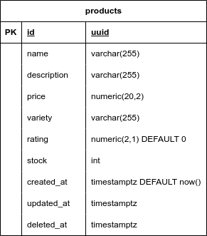

# Products API

## Requirements

- Go >= 1.23
- [Docker](https://docs.docker.com/get-started/get-docker/)
- Docker Compose
- [Goose](https://github.com/pressly/goose) (for database migration)
- [Make](https://www.gnu.org/software/make/#download) (for running scripts)

## App Dependencies

- Postgres
- Goose

## How to Run

- Prepare environment variables, also you can refer to [.env.example](./.env.example)

```bash
ENV=development|production
PORT=8080
DSN=postgresql://<username>:<password>@<host>:<port>/<database>
```

- Using docker compose

```bash
# Build
docker compose build
# or
make build

# Run
docker compose up -d

# Stop and delete volumes
docker compose down -v
```

- Manually

```bash
# Run postgres server using credentials admin:admin/product on port 5432
make postgres

# Check migration status
make migrate-status

# Start migration
make migrate-up

# Run api
make run

# Reset migration
make migrate-reset
```

## API Endpoints

| METHOD | PATH                 | Description                                                        | Input                                                                                                                          |
|--------|----------------------|--------------------------------------------------------------------|--------------------------------------------------------------------------------------------------------------------------------|
| **GET**    | /api/v1/products/:id | GET single product                                                 | params id: uuid                                                                                                                |
| **GET**    | /api/v1/products/    | GET all products paginated                                         | {"page_size": int?=10, "page": int?=1, "sort": "<field> <asc\|desc>"?="id asc"}                                                |
| **PUT**    | /api/v1/products/    | UPDATE single product by replacing whole data with input           | {"id": uuid_v4, "name": string, "description": string?, "price": float, "variety": string?, "rating": float?, "stock": int}    |
| **PATCH**  | /api/v1/products/    | UPDATE single product by replacing partial data with defined input | {"id": uuid_v4, "name": string?, "description": string?, "price": float?, "variety": string?, "rating": float?, "stock": int?} |
| **POST**   | /api/v1/products/    | CREATE single product                                              | {"name": string, "description": string?, "price": float, "variety": string?, "stock": int}                                     |
| **DELETE** | /api/v1/products/:id | DELETE single product                                              | params id: uuid                                                                                                                |

> **Symbols
> 
> **?** -> nullable\
> **?=value** -> nullable with default value

## Database Diagram



## Architecture

```
├── cmd
│   ├── api
│   └── migration
├── config
├── go.mod
├── go.sum
├── internal
│   ├── api
│   ├── entity
│   ├── model
│   └── router
└── pkg
    ├── datasource
    ├── exception
    ├── logger
    ├── utils
    └── validation

```

### CMD
Folder ini berisi file `main.go` yang dapat dibuild menjadi executable sebagai entrypoint Docker.

### Config
package ini digunakan untuk membaca configuration aplikasi seperti **Environment Variables**. Untuk config ini sudah dapat membaca `file .env` dan `ENV OS`.

### Internal
Folder ini berisi core applikasi yang terdiri dari `api`, `entity`, dan `model`.

#### API
Package ini berisi handler, repository, router, dan usecase.

- Handler -> atau bisa dibilang controller sebagai entrypoint dari http API.
- Repository -> sebagai DTO dari Database ke API.
- Usecase -> berisi business logic untuk mengolah data yang diterima dari repository.

#### Entity
Package ini berisi model yang digunakan oleh DTO yang memiliki struktur 1:1 dengan database schema.

#### Model
Package ini berisi model yang digunakan sebagai request dan response dari HTTP.

#### Router
Package ini berisi konfigurasi HTTP Router (Echo) yang digunakan oleh API.

### Migrations
Folder ini berisi file sql yang digunakan proses migrasi database.

### Mocks
Folder ini merupakan hasil generate dari library mockery untuk membuat `mocks` dalam proses testing.

### Pkg
Pkg sendiri merupakan folder yang berisi utilitas dan singleton yang dapat digunakan berulang kali seperti **database instance**, **logger**, **validator**, hingga **helper functions**.